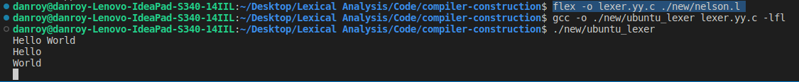

# compiler-construction

## Group Members

- 136509-Trevor Muthoka
- 136789-Michael Muya
- 132459-Natasha Gichuhi
- 136290-Yahya Khalif
- 134979-Nelson Mwangi
- 136236-Cynthia Muiruri
- 134948-Danroy Ndungu

## UBUNTU

### Install Flex

To install flex on ubuntu run the following command: `sudo apt install flex`

### Getting the lexical analyzer

1. Create a file with extension `name_of_l_file.l` that will store all the rules.
2. Use flex to convert the `.l` file to by running the command `flex -o name_of_lexer.yy.c name_of_l_file.l`
3. Output the lexical analyzer using the command `gcc -o name_of_lexical_analyzer lexer.yy.c -lfl`
4. Run the output from 3 above to test out the lexical analyzer that has been generated as a bash script.
5. Type a sentence and watch the magic happen 😉
6. To exit press `crtl + z`

## Windows

1. Install `MinGW`: Download and install `MinGW` from the official website: `MinGW`.
2. During the installation process, make sure to select the option to install the "MSYS Basic System".
3. Add `MinGW` to PATH: After installing `MinGW`, add its binaries to your system's PATH environment variable.
4. Create Lexical Rules File: Create a file with extension `name_of_l_file.l` and save it with your lexical rules.
5. Open the Command Prompt on your Windows system.
6. Run Flex: Navigate to the directory where you saved `name_of_l_file.l` using the Command Prompt.
7. Run the following command to generate the lexical analyzer: `flex -o name_of_lexer.yy.c name_of_l_file.l`
8. Compile the Lexical Analyzer: `gcc -o name_of_lexical_analyzer name_of_lexer.yy.c -lfl`
9. Run the Lexical Analyzer: `name_of_lexical_analyzer.exe`
10. Test the Lexical Analyzer: Type a sentence and observe the output.
11. Exit the Lexical Analyzer: Press `Ctrl + Z` to exit.
