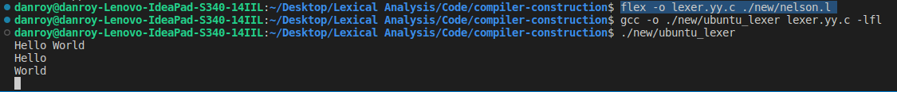

# compiler-construction

## UBUNTU

### Install Flex

To install flex on ubuntu run the following command: `sudo apt install flex`

### Getting the lexical analyzer

1. Create a file with extension `name_of_l_file.l` that will store all the rules.
2. Use flex to convert the `.l` file to by running the command `flex -o name_of_lexer.yy.c name_of_l_file.l`
3. Output the lexical analyzer using the command `gcc -o name_of_lexical_analyzer lexer.yy.c -lfl`
4. Run the output from 3 above to test out the lexical analyzer that has been generated as a bash script.
5. Type a sentence and watch the magic happen 😉
6. To exit press `crtl + z`

